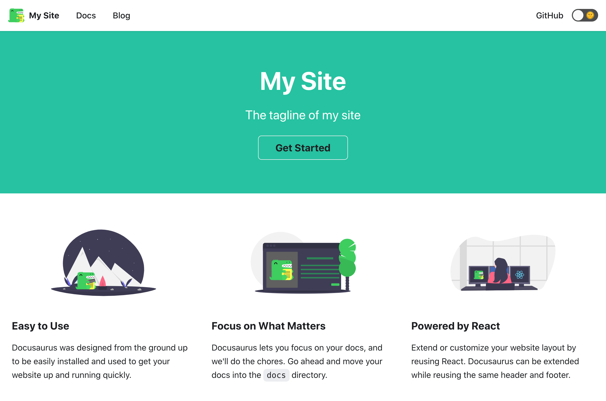

# 阿里云 Serverless 部署 Docusaurus 应用

## 环境准备

### 安装 Funcraft

Funcraft 是函数计算提供的一种命令行工具，通过该工具，您可以便捷地管理函数计算、API网关、日志服务等资源。通过一个资源配置文件 template.yml ， Funcraft 即可协助您进行开发、构建、部署操作。

`npm` 安装：

```zsh
npm install @alicloud/fun -g
```

`fun` 版本：

```zsh
❯ fun --version
3.6.17
```

`fun` 配置：

```zsh
❯ fun config
? Aliyun Account ID ***********
? Aliyun Access Key ID ***********AmpG
? Aliyun Access Key Secret ***********XZlY
? Default region name cn-shanghai
? The timeout in seconds for each SDK client invoking 60
? The maximum number of retries for each SDK client 3
? Allow to anonymously report usage statistics to improve the tool over time? Ye
s
? Use custom endpoint? No
```

## 创建应用

```zsh
npx @docusaurus/init@next init my-site classic
```

运行：

```zsh
cd my-site
yarn start
```

效果：



## 部署应用

```zsh
❯ cd my-site
```

初始化：

```zsh
❯ fun init
? Select a template to init http-trigger-nodejs12
? You've created /users/ikuokuo/start-serverless/my-site before. Is it okay to override it? Yes
Start rendering template...
+ /users/ikuokuo/start-serverless/my-site
+ /users/ikuokuo/start-serverless/my-site/.funignore
+ /users/ikuokuo/start-serverless/my-site/index.js
+ /users/ikuokuo/start-serverless/my-site/template.yml
finish rendering template.
```

删除 `index.js`。

```zsh
rm index.js
```

修改 `template.yml`：

```yml
ROSTemplateFormatVersion: '2015-09-01'
Transform: 'Aliyun::Serverless-2018-04-03'
Resources:
  my-site:
    Type: 'Aliyun::Serverless::Service'
    Properties:
      Description: 'helloworld'
    my-site:
      Type: 'Aliyun::Serverless::Function'
      Properties:
        Handler: index.handler
        Runtime: custom
        CodeUri: './'
        MemorySize: 1024
        InstanceConcurrency: 5
        Timeout: 120
      Events:
        httpTrigger:
          Type: HTTP
          Properties:
            AuthType: ANONYMOUS
            Methods: ['GET', 'POST', 'PUT']
  Domain:
    Type: Aliyun::Serverless::CustomDomain
    Properties:
      DomainName: Auto
      Protocol: HTTP
      RouteConfig:
        Routes:
          "/*":
            ServiceName: my-site
            FunctionName: my-site
```

创建 `bootstrap`：

```bash
❯ cat <<EOF >bootstrap
#!/usr/bin/env bash
export PORT=9000
npm run serve -- --port $PORT
# yarn serve --port $PORT
EOF
❯ chmod a+x bootstrap
```

<!--
* https://github.com/facebook/docusaurus/issues/3505
-->

编译：

```zsh
yarn build
```

<!--
fun local start
-->

部署：

<!--
❯ fun deploy -y
current folder is not a fun project.
could not detect your project framework, please contact us on https://github.com/alibaba/funcraft/issues
-->

```zsh
❯ fun deploy
using template: template.yml
using region: cn-shanghai
using accountId: ***********
using accessKeyId: ***********AmpG
using timeout: 60

Collecting your services information, in order to caculate devlopment changes...

Resources Changes(Beta version! Only FC resources changes will be displayed):

┌─────────────┬──────────────────────────────┬────────┬─────────────────────┐
│ Resource    │ ResourceType                 │ Action │ Property            │
├─────────────┼──────────────────────────────┼────────┼─────────────────────┤
│ my-site     │ Aliyun::Serverless::Service  │ Add    │ Description         │
├─────────────┼──────────────────────────────┼────────┼─────────────────────┤
│             │                              │        │ Handler             │
│             │                              │        ├─────────────────────┤
│             │                              │        │ Runtime             │
│             │                              │        ├─────────────────────┤
│             │                              │        │ CodeUri             │
│ my-site     │ Aliyun::Serverless::Function │ Add    ├─────────────────────┤
│             │                              │        │ MemorySize          │
│             │                              │        ├─────────────────────┤
│             │                              │        │ InstanceConcurrency │
│             │                              │        ├─────────────────────┤
│             │                              │        │ Timeout             │
├─────────────┼──────────────────────────────┼────────┼─────────────────────┤
│             │                              │        │ AuthType            │
│ httpTrigger │ HTTP                         │ Add    ├─────────────────────┤
│             │                              │        │ Methods             │
└─────────────┴──────────────────────────────┴────────┴─────────────────────┘

? Please confirm to continue. Yes
Waiting for service my-site to be deployed...
        Waiting for function my-site to be deployed...
                Waiting for packaging function my-site code...
                The function my-site has been packaged. A total of 29625 files were compressed and the final size was 37.05 MB
                Waiting for HTTP trigger httpTrigger to be deployed...
                triggerName: httpTrigger
                methods: [ 'GET', 'POST', 'PUT' ]
                trigger httpTrigger deploy success
        function my-site deploy success
service my-site deploy success

Detect 'DomainName:Auto' of custom domain 'Domain'
Request a new temporary domain ...
The assigned temporary domain is http://32172743-1117460590419785.test.functioncompute.com，expired at 2020-10-18 23:59:03, limited by 1000 per day.
Waiting for custom domain Domain to be deployed...
custom domain Domain deploy success
```
