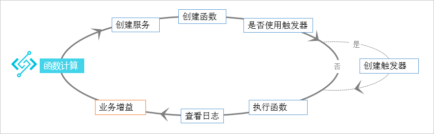
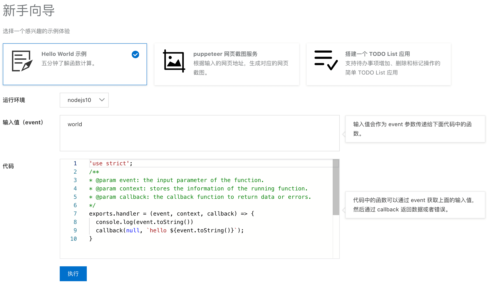
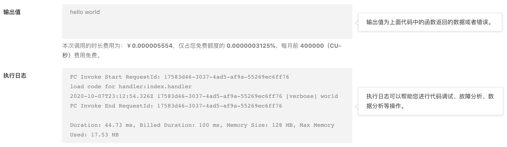
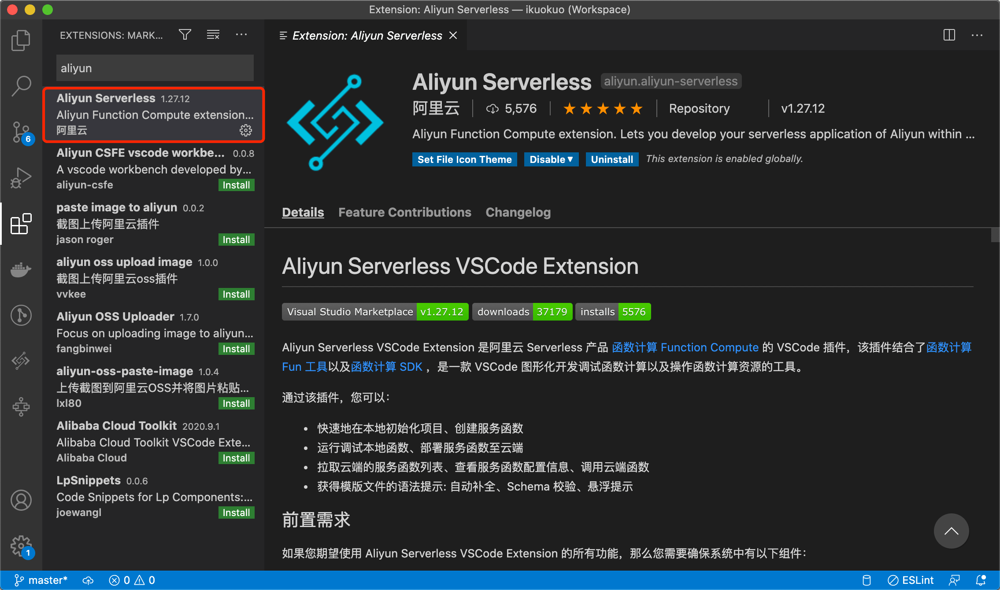
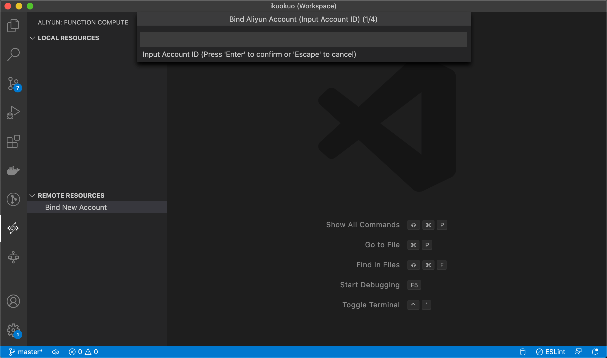
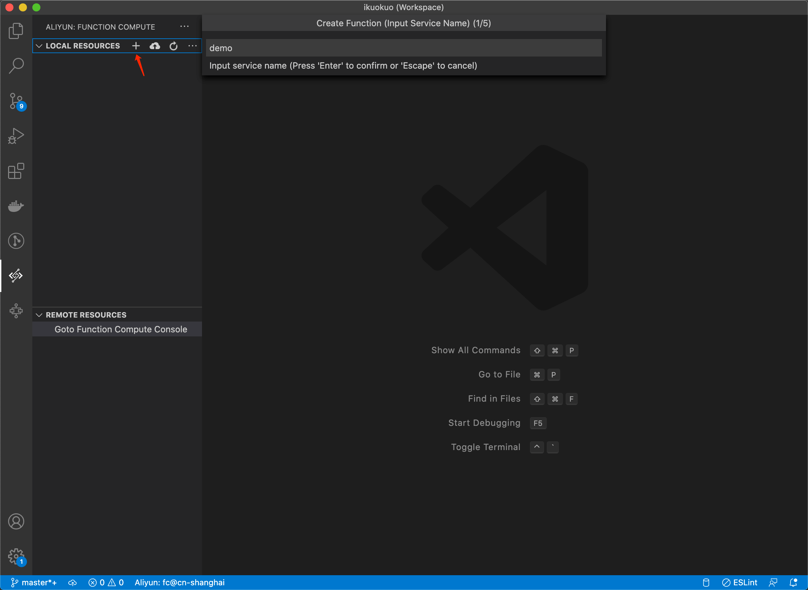
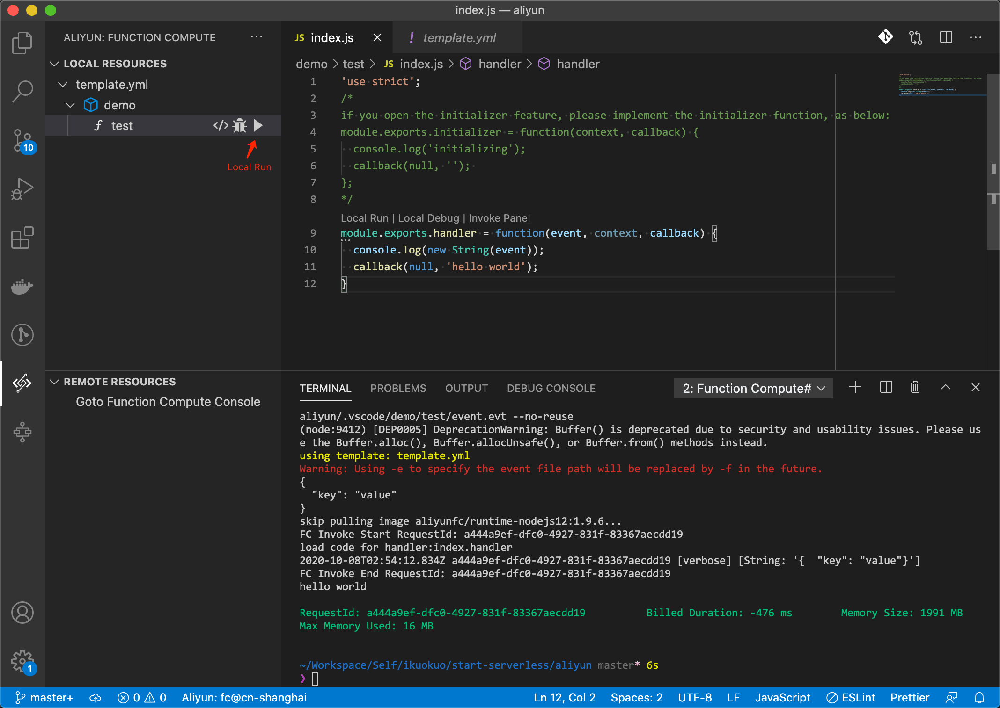
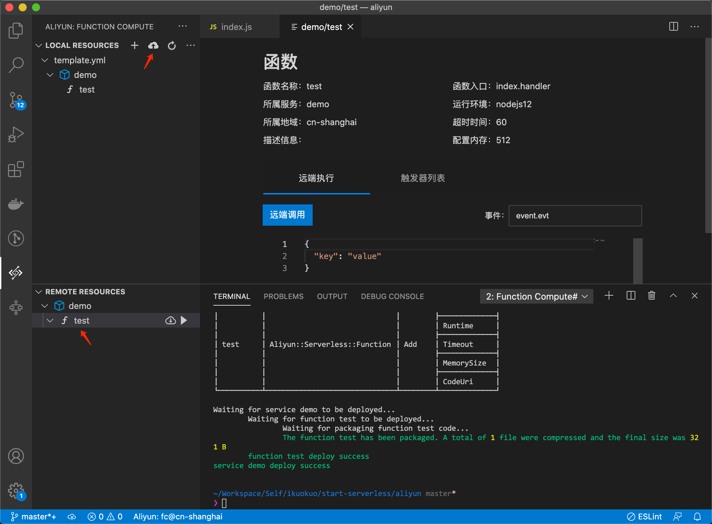
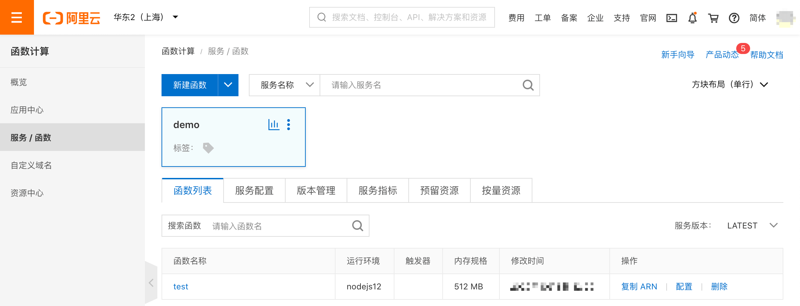

# [函数计算 - 阿里云](https://help.aliyun.com/product/50980.html)

## 使用简介

[产品页](https://www.aliyun.com/product/fc)开通服务。使用流程，如下：

新手示例，如下：

## 创建函数

阿里云提供了如下几种方式创建函数：

* [使用控制台创建函数](https://help.aliyun.com/document_detail/51783.html)
* [使用Funcraft创建函数](https://help.aliyun.com/document_detail/155100.html)
* [使用VSCode插件创建函数](https://help.aliyun.com/document_detail/155679.html)

以下为使用 VSCode 插件创建函数。

### 前提条件

#### 安装软件

* [Visual Studio Code](https://code.visualstudio.com/)
* [Docker](https://docs.docker.com/get-docker/)

#### 安装插件

插件： [Aliyun Serverless VSCode Extension](https://github.com/alibaba/serverless-vscode/)

VSCode 插件市场搜索 "aliyun" ，安装：

左侧边栏，打开插件，绑定账户：

依次输入 Account ID, AccessKey ID, AccessKey Secret, Account Alias 。

绑定后， "REMOTE RESOURCES" 可以看到该账户的云端服务与函数列表。

### 本地创建

"LOCAL RESOURCES" 面板 "+" 创建函数：

输入内容：

    service name: demo
    function name: test
    function runtime: nodejs12
    function type: NORMAL (Event Trigger)

### 本地运行

函数名称上 "Local Run" 运行：

函数日志，输出在终端。

### 远程部署

"LOCAL RESOURCES" 面板 "Deploy" 部署函数：

"REMOTE RESOURCES" 可查看部署的函数。

或者到阿里云[函数计算控制台](https://fc.console.aliyun.com)查看：

