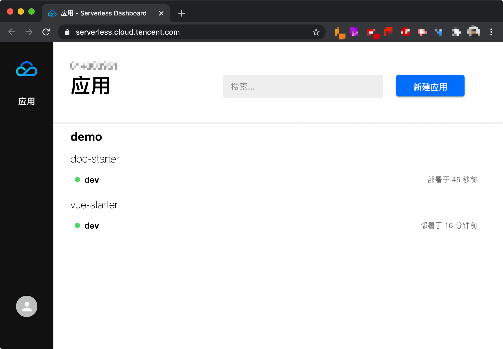

# [Serverless - 腾讯云](https://cloud.tencent.com/document/product/1154)

## 安装

```zsh
npm install -g serverless
npm update -g serverless
```

```zsh
❯ serverless -v
Framework Core: 2.8.0
Plugin: 4.1.1
SDK: 2.3.2
Components: 3.2.7
```

## [快速部署](https://cloud.tencent.com/document/product/1154/41775)

```zsh
❯ serverless
Serverless: 当前未检测到 Serverless 项目，是否希望新建一个项目？ Yes
Serverless: 请选择你希望创建的 Serverless 应用 vue-starter - 快速部署一个 Vue.js 基础应用
Serverless: 请输入项目名称 demo
Serverless: 正在安装 vue-starter 应用...

vue-starter › Created

demo 项目已成功创建！

Serverless: 是否希望立即将该项目部署到云端？ Yes

Please scan QR code login from wechat.
Wait login...
Login successful for TencentCloud.

serverless ⚡framework
Action: "deploy" - Stage: "dev" - App: "demo" - Instance: "vue-starter"

region:  ap-guangzhou
website: https://my-vue-starter-1255876835.cos-website.ap-guangzhou.myqcloud.com

Full details: https://serverless.cloud.tencent.com/apps/demo/vue-starter/dev

Serverless应用已经成功部署，您将享有 30 天免费额度。计费详情：https://url.cn/T1uSQD5C

88s › vue-starter › Success
```

访问 https://my-vue-starter-1255876835.cos-website.ap-guangzhou.myqcloud.com 查看应用。

### 查看信息

```zsh
❯ cd demo
❯ sls info

serverless ⚡framework

Last Action:  deploy (8 minutes ago)
Deployments:  1
Status:       active
More Info:    Full details: https://serverless.cloud.tencent.com/apps/demo/vue-starter/dev

region:                ap-guangzhou
website:               https://my-vue-starter-1255876835.cos-website.ap-guangzhou.myqcloud.com
sourceCodeDownloadUrl: https://sp-ins-prod-1300963013.cos.ap-guangzhou.myqcloud.com/**

vue-starter › Info successfully loaded
```

### 开发调试

```zsh
sls dev
```

### 移除项目

```zsh
sls remove
```

## 部署 Docusaurus

### 创建应用

```zsh
npx @docusaurus/init@next init my-site classic
```

运行：

```zsh
cd my-site
yarn start
```

### 部署应用

```zsh
cd my-site
touch serverless.yml
```

`serverless.yml`:

```yml
component: website
name: doc-starter
app: demo
inputs:
  src:
    src: ./src
    hook: yarn build
    dist: ./build
  bucketName: my-doc-starter
  protocol: https
```

部署：

```zsh
serverless
```

## Serverless 控制台

访问 https://serverless.cloud.tencent.com/ 查看应用：


